# ラクシス — 小さな会社の情シスを、コードで運営する

IT担当が「ひとり」または「いない」中小企業向けの、月額制ITサポート事業「ラクシス」のリポジトリです。
**Webサイト**と、営業から契約・運用・請求・解約までに使う**書類12種・スライド13枚**を、1つのコードベースから生成します。

> 料金を1行変えれば、サイト・契約書・見積書・請求書・料金表・スライドがすべて同じ値に揃う。
> 変えていない書類が1文字でも変わったら、自動で検知する。

<p>
<a href="https://github.com/bright-broom/inofo-system/actions/workflows/ci.yml"></a>


</p>

---

## 目次

1. [ひとことで言うと](#ひとことで言うと)
2. [システム全体像](#システム全体像)
3. [顧客のライフサイクルと書類](#顧客のライフサイクルと書類)
4. [料金の唯一の定義 — pricing.json](#料金の唯一の定義--pricingjson)
5. [Webサイトのアーキテクチャ](#webサイトのアーキテクチャ)
6. [書類生成パイプライン](#書類生成パイプライン)
7. [スライド — React から HTML へ](#スライド--react-から-html-へ)
8. [回帰検知 — 変えていないものは1文字も変えない](#回帰検知--変えていないものは1文字も変えない)
9. [設計判断の記録](#設計判断の記録)
10. [品質・セキュリティ・アクセシビリティ](#品質セキュリティアクセシビリティ)
11. [ディレクトリ構成](#ディレクトリ構成)
12. [セットアップと日々の操作](#セットアップと日々の操作)
13. [CI とリリース](#ci-とリリース)
14. [既知の制約と今後](#既知の制約と今後)

---

## ひとことで言うと

小さな会社のIT支援は「人」に頼りがちで、料金表・契約書・見積書・スライドがそれぞれ手作業で更新され、少しずつ食い違っていきます。
このリポジトリは、その**事業の書類一式をソフトウェアとして扱う**ことで、食い違いを構造的に起こらなくしています。

| 課題 | このリポジトリでの解決 |
|---|---|
| 料金を変えると、書類ごとに直し忘れが出る | 料金・時間・条件を `config/pricing.json` の1か所に集約し、全出力がそこから生成される |
| 書類のテンプレートを直したら、別の書類が壊れていた | 全書類の中身を正規化して保存し、変更前後を自動で比較する（`./build_all.sh --check`） |
| スライドが手書き HTML で、同じ装飾が13枚に重複 | React コンポーネント化し、部品と色・書体を1か所で管理。手書き HTML はゼロ |
| 契約書の条件と、サイト・見積書の条件がずれる | 契約書の別紙（プランの内容表）と料金表が同じデータ定義を共有する |
| 料金の打ち間違いが、そのまま契約書やサイトに出る | `pricing.json` の入力チェックで、範囲の抜け・逆転・「上位ほど割安」との矛盾などを CI で止める |
| 仮の値（ダミーのメールアドレスなど）のまま公開してしまう | 公開前チェック（`npm run release:check`）が、残っている仮の値をファイルと行番号付きで列挙する |

---

## システム全体像

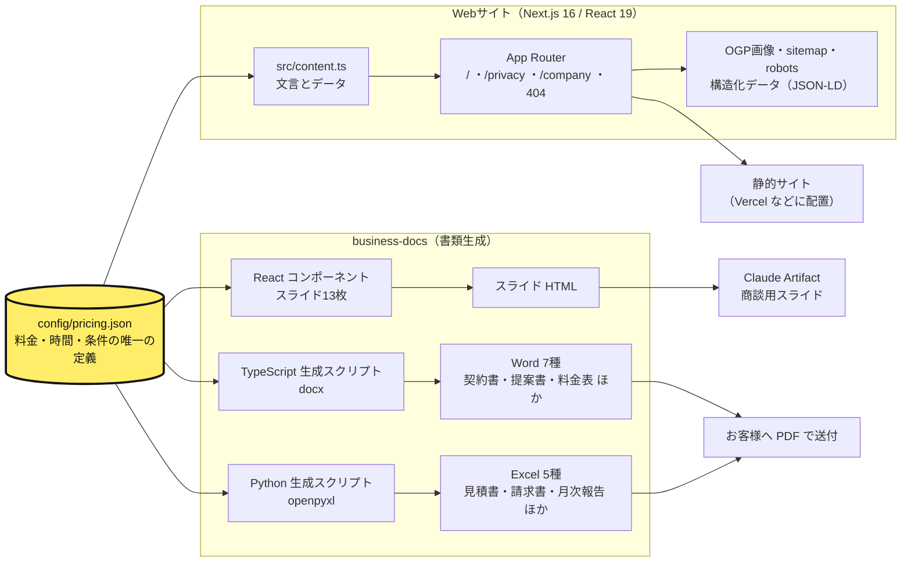

**ポイント**：矢印の出発点がすべて `pricing.json` です。サイトも書類もスライドも、料金を**自分では持っていません**。

---

## 顧客のライフサイクルと書類

営業から解約まで、どの段階でどの書類を使うかを網羅しています。

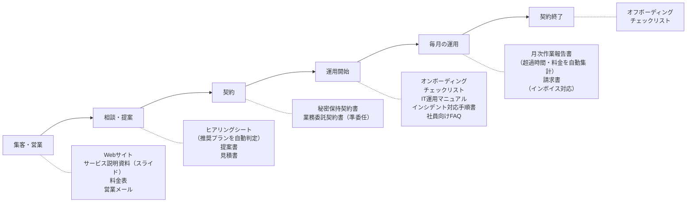

書類どうしも噛み合うように作っています。たとえば、月次報告書が自動で出す超過料金は、そのまま請求書の超過行になります。また、ヒアリングシートの「要対応」項目は、提案書の「現状と課題」の並びと同じです。

---

## 料金の唯一の定義 — pricing.json

### データモデル

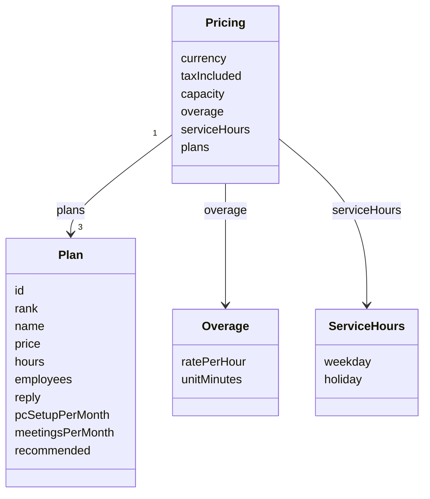

| 項目 | 意味 | 例 |
|---|---|---|
| `plans[].price` / `hours` | 月額（税別）と月の対応時間 | `60000` / `12` |
| `plans[].employees` | 対象の従業員数 `[下限, 上限]` | `[15, 40]` |
| `plans[].reply` | 返信の目安（対応時間内） | `当日中` |
| `plans[].pcSetupPerMonth` / `meetingsPerMonth` | 月のPCセットアップ台数・定例回数 | `3` / `1` |
| `overage.ratePerHour` / `unitMinutes` | 超過単価と計算単位 | `5000` / `15` |
| `capacity` | 同時に受ける社数の上限 | `4` |
| `serviceHours` | 平日・土日祝の対応時間 | `19:00〜22:00` |

### 誰がどの値を読んでいるか

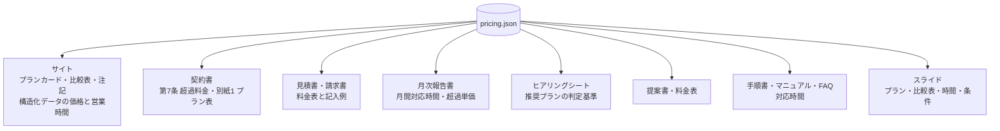

### 入力チェック

`config/validate-pricing.mts` が、次のことを確かめます（CI で PR ごとに実行）。どれも、サイト・書類・スライドが前提にしていることで、崩れると表示が嘘になるか、生成が壊れます。

- プランは `lite → standard → pro` の3つ（生成コードが id で参照しているため）
- 金額・時間は正の整数。上位プランほど月額が高く、時間が多い
- **上位プランほど1時間あたりが割安**（サイトと資料にそう書いているため）
- 対象人数の範囲が途切れない（〜15名 → 15〜40名 → 40〜80名）
- 「おすすめ」はちょうど1つ
- 対応時間は `HH:MM` で、開始 < 終了。超過の計算単位は60を割り切れる分数

表記の整形（`30000` → `30,000`、`[15, 40]` → `従業員 15〜40名` など）も共通部品（`lib_pricing.ts` / `pricing.py`）に閉じ込めています。そのため、同じ値が書類ごとに違う書き方で出ることもありません。

---

## Webサイトのアーキテクチャ

### ページとコンポーネント

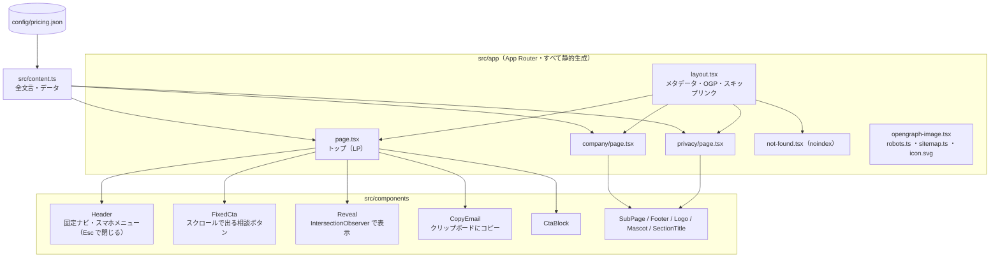

### トップページの情報設計

「読ませる」より「選べる」ことを優先して、比較のしやすさで並べています。


- **3プラン（松竹梅）**：真ん中を「おすすめ」として強調し、上位プランを基準点（アンカー）にしています。上位ほど1時間あたりが割安になる料金設計です。
- **問い合わせはフォームを持たない**：件名と本文のひな形が入ったメール作成リンクと、アドレスのコピーボタンだけにしています。サーバー処理が不要なので、全ページが静的です。
- **「できないこと」も明記**：即時の駆けつけや24時間監視はしない、と書いています。ひとり運営の事業で、守れない約束をサイトに書かないためです。

---

## 書類生成パイプライン

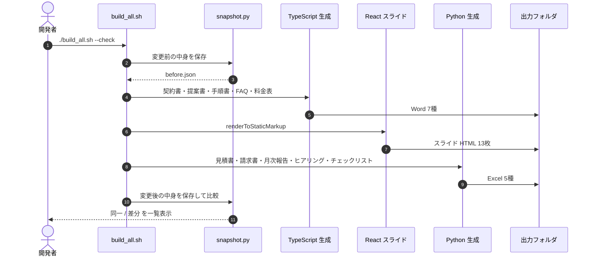

| 出力 | 形式 | 生成元 | 主な工夫 |
|---|---|---|---|
| 業務委託契約書・秘密保持契約書 | Word | `build_contracts.ts` | 偽装請負にならない条項、別紙のプラン表をデータから生成 |
| 提案書 | Word | `build_proposal.ts` | ヒアリングシートの結果をそのまま転記できる章立て |
| 料金表 | Word | `build_pricelist.ts` | 金額の直書きゼロ。税込（参考）と1時間あたりの実質単価を計算 |
| IT運用マニュアル | Word | `build_manual.ts` | 契約書 第11条の「成果物」として引き渡す前提 |
| インシデント対応手順書 | Word | `build_incident.ts` | 24時間対応しない前提で、対応時間外の初動を明記 |
| 社員向けFAQ | Word | `build_faq.ts` | 目次と本文の番号を自動で一致させ、手順書の該当章へ相互参照 |
| 見積書・請求書 | Excel | `build_xlsx.py` | 税率ごとに1回だけ端数処理（インボイス制度） |
| 月次作業報告書 | Excel | `build_report.py` | 作業記録から件数・時間・超過料金を自動集計 |
| ヒアリングシート | Excel | `build_hearing.py` | 従業員数と作業時間の「大きい方」で推奨プランを判定 |
| オンボーディング／オフボーディング | Excel | `build_onboarding.py`・`build_offboarding.py` | 基準日から期限を自動計算、期限切れを色で表示 |

Excel は、数式の結果を値として埋め込まずに**数式のまま**出力しています。お客様が数字を書き換えても、正しく再計算されます。数式が正しく計算されることは、`./build_all.sh --check` のたびに `formulas`（Excel の数式を再計算できる Python ライブラリ）で確かめています。

---

## スライド — React から HTML へ

商談用スライドは、決められた形式の HTML（1枚＝1つの `<section>`、スタイルはすべてインライン）で公開する必要があります。
その HTML を**手で書かず**、React コンポーネントから書き出しています。

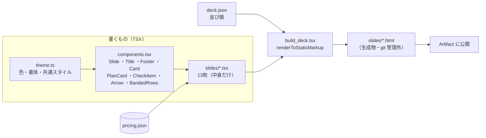

- **ページ番号は並び順から自動**：スライドを入れ替えても、番号を直す必要はありません。
- **並び順とコンポーネントの対応を起動時に検証**：`deck.json` の並び順と実装が食い違っていたら、生成を止めます。
- **比較表・プランカードはデータから組み立てる**：プランを増やせば、カードも表の列も増えます。

---

## 回帰検知 — 変えていないものは1文字も変えない

このリポジトリでいちばん大事にしている仕組みです。リファクタリングの前後で「中身が変わっていない」ことを、目視ではなく機械で確かめます。

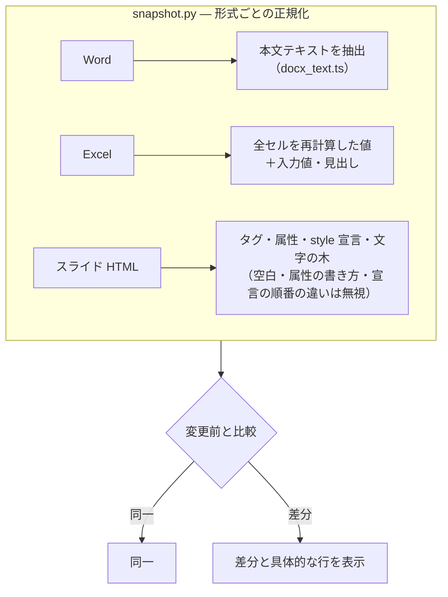

たとえばスライドを手書き HTML から React に置き換えたときは、HTML の書き方が変わるので、文字列の比較では差分だらけになります。
そこで HTML を構造（タグ・属性・スタイルの各宣言・文字）に正規化して比べ、**13枚・1,261項目が元の手書き HTML と完全に一致**することを確かめてから置き換えました。

これまでの大きな変更は、すべてこの確認を通しています。

| 変更 | 確認したこと |
|---|---|
| 料金を `pricing.json` に集約 | 書類11種とサイトの表示テキスト（5,645文字）が変更前と完全一致 |
| 料金を試しに変更 | 料金の載った書類・スライドにだけ新しい値が入り、古い値が1つも残らない。戻すとバイト単位で元に戻る |
| 生成スクリプトを JavaScript から TypeScript へ | 書類12種・スライド13枚（25点）が完全一致 |
| スライドを React 化 | 13枚・1,261項目の構造が完全一致 |

---

## 設計判断の記録

| # | 判断 | 理由 | 代わりに検討したもの |
|---|---|---|---|
| 1 | 料金は `pricing.json` の1ファイルだけに置く | 15ファイルに直書きされていて、変更のたびに食い違いが起きる状態だったため | 各書類に定数を持たせる（直し忘れが防げない） |
| 2 | 文言（マーケティングの言い回し）は各出力に残す | 数値と違い、書類ごとに適切な言い回しが違う。無理に共通化すると不自然になる | 文言も全部 JSON 化（読みにくく、直しにくい） |
| 3 | 生成物（`out/`・スライド HTML）は git に入れない | いつでも作り直せるものを入れると、差分がノイズになる | 生成物もコミット（レビュー時に本質的な差分が埋もれる） |
| 4 | TypeScript はビルドせず Node.js で直接実行 | Node.js 22.18 以降は型を取り除いて直接実行できる。ビルド手順と出力フォルダが要らない | tsc でビルドしてから実行（手順が増える） |
| 5 | JSX（スライド）だけ `tsx` を `node --import tsx` で読み込む | Node.js 本体は JSX を変換できないため。ランチャー経由より依存する機能が少ない | ランチャー（`npx tsx`）経由で実行 |
| 6 | スライドの比較は「構造」で行う | React と手書きで書き方は変わるが、見た目を決めるのは構造。書き方の差で誤検知しない | 文字列の完全一致（誤検知だらけ） |
| 7 | `postcss.config.mjs` だけ JavaScript のまま | `.ts` にすると Next.js が読み込まず、Tailwind が動かない CSS になることを確認したため | `.ts` 化（サイトのデザインが消える） |
| 8 | 問い合わせフォームを持たない | ひとり運営で、受付システムを保守する負担を避ける。全ページを静的にできる | フォーム＋メール送信 API |

---

## 品質・セキュリティ・アクセシビリティ

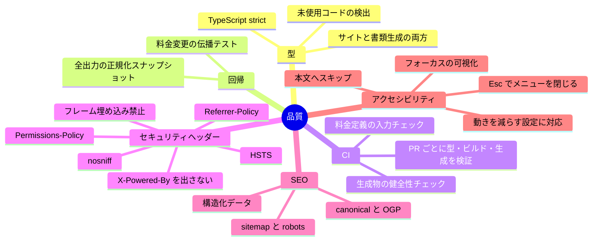

- **構造化データ（JSON-LD）**：会社、サービス（3プランの価格と営業時間）、FAQ を検索エンジンに伝えます。値はすべて `pricing.json` から入ります。
- **OGP画像**：`next/og` でビルド時に生成します。
- **404ページ**：専用のタイトルを付け、検索結果に載らないようにしています。

---

## ディレクトリ構成

```
.
├── .github/workflows/ci.yml    CI（PR ごとにサイトと書類生成を検証）
├── config/
│   ├── pricing.json            料金・時間・条件の唯一の定義
│   └── validate-pricing.mts    pricing.json の入力チェック
├── scripts/
│   └── release-check.mts       公開前チェック（仮の値の検出）
├── src/                        Webサイト（Next.js App Router）
│   ├── content.ts              サイトの全文言とデータ（数値は pricing.json から）
│   ├── app/                    ページ・OGP画像・sitemap・robots
│   └── components/             ヘッダー・固定CTA・表示アニメーション など
└── business-docs/              書類・スライドの生成
    ├── build_all.sh            全出力の生成と回帰チェック（--check）
    ├── lib_pricing.ts          pricing.json の読み込みと表記の整形（TypeScript）
    ├── pricing.py              同上（Python）
    ├── lib_docx.ts             Word の共通デザイン
    ├── build_*.ts              Word の生成（7種）
    ├── build_*.py              Excel の生成（5種）
    ├── build_deck.tsx          スライドを HTML に書き出す
    ├── deck/
    │   ├── theme.ts            色・書体
    │   ├── components.tsx      スライドの部品
    │   ├── slides/*.tsx        スライド13枚
    │   └── project/deck.json   並び順（公開先の設定）
    ├── snapshot.py             回帰チェック（--check）と生成物の健全性チェック（--verify）
    └── docx_text.ts            Word の本文抽出
```

コードは約5,100行です（サイト 約1,400行、書類生成 約3,500行）。書類の本文（契約条項など）も、コードの一部として管理しています。

---

## セットアップと日々の操作

### 必要なもの

- Node.js 22.18 以上（TypeScript をビルドなしで実行するため。`.nvmrc` と `engines` で指定）
- Python 3（Excel の生成と検証）

### Webサイト

```bash
npm install
npm run dev      # http://localhost:3000
npm run build    # 本番ビルド
npm run typecheck          # 型チェック
npm run validate:pricing   # pricing.json の入力チェック
npm run release:check      # 公開前チェック（仮の値が残っていれば一覧を出して失敗）
```

公開前に、`src/content.ts` の仮の値（メールアドレス・運営者名）と、環境変数 `NEXT_PUBLIC_SITE_URL`（本番URL）を設定してください。

### 書類・スライド

```bash
cd business-docs
npm install
python3 -m venv .venv && .venv/bin/pip install -r requirements.txt
./build_all.sh           # 全書類とスライドを生成（out/ と deck/project/slides/）
./build_all.sh --check   # 生成して、変更前との差分を表示
.venv/bin/python snapshot.py --verify   # 生成物がそろっていて壊れていないか（CI と同じ）
npm run deck             # スライドだけ生成
npm run typecheck        # 型チェック
```

### 料金を変えるとき

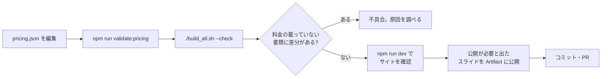

- スライドの文言は `deck/slides/*.tsx` を、見た目の共通部分は `deck/components.tsx` と `deck/theme.ts` を直します。
- スライドの並び順は `deck/project/deck.json` の `order` です。
- 書類の〔　〕は、お客様ごとに書き換える箇所です。記入例は、すべて同じ架空の会社（サンプル商事株式会社・25名・スタンダード）でそろえています。
- 契約書・プライバシーポリシー・インシデント対応手順書は雛形です。使う前に専門家の確認を受けてください。

---

## CI とリリース

### CI（GitHub Actions）

PR ごと、`main` への push ごとに、サイトと書類生成を並列に検証します。

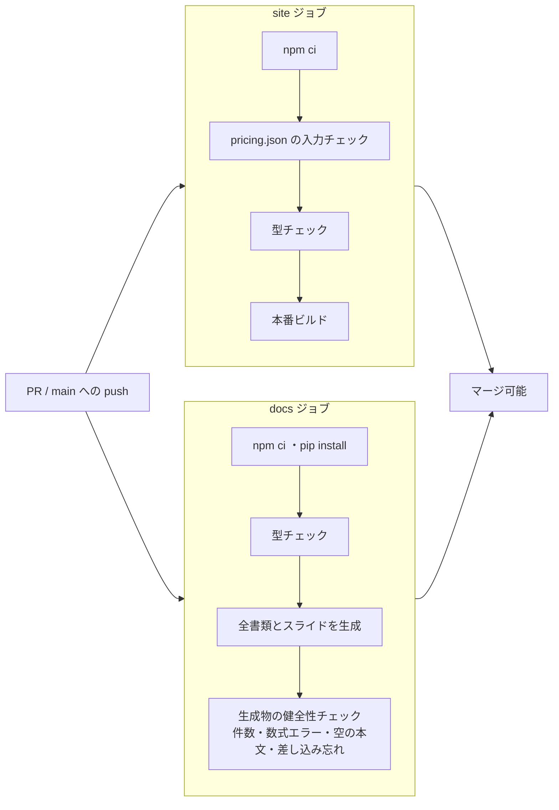

CI の中には「変更前」の生成物がないため、前後比較（`--check`）ではなく、生成物そのものの健全性（`--verify`）を確かめます。前後比較は、リファクタリングのときに手元で行います。

### 公開前チェックリスト

`npm run release:check` が、次の1〜3を機械的に確かめます。問題があれば、ファイル名と行番号付きで一覧を出して失敗します。

1. 環境変数 `NEXT_PUBLIC_SITE_URL` に本番URL（`https://`）が設定されている
2. `src/content.ts` などに、仮の値（`example.com`・仮の運営者名・未記入の〔　〕）が残っていない
3. `pricing.json` の入力チェックが通る
4. （手作業）契約書・プライバシーポリシー・インシデント対応手順書を専門家に確認してもらった
5. （手作業）CI が通っていることを PR で確認した

公開前チェックは CI では実行しません。仮の値が残っている間は必ず失敗するので、CI に入れるとすべての PR が止まってしまうためです。公開の直前に、手元で実行します。

## 既知の制約と今後

| 項目 | 現状 | 次の一手 |
|---|---|---|
| Content-Security-Policy | 未設定（他のセキュリティヘッダーは設定済み） | Next.js が差し込むインラインスクリプトに合わせた CSP を、本番環境で表示を確かめながら追加 |
| スライドの公開 | 生成後、変わったスライドを手で Artifact に公開する | 公開までを自動化 |
| 書類生成の言語 | Word とスライドは TypeScript、Excel は Python（数式の再計算による検証に Python の `formulas` を使っているため） | Excel 生成も TypeScript に寄せ、ツールチェーンを1つにする |
| 仮の値 | メールアドレス・運営者名・本番URLが仮 | 公開前に差し替え（`npm run release:check` が残りを列挙する） |
